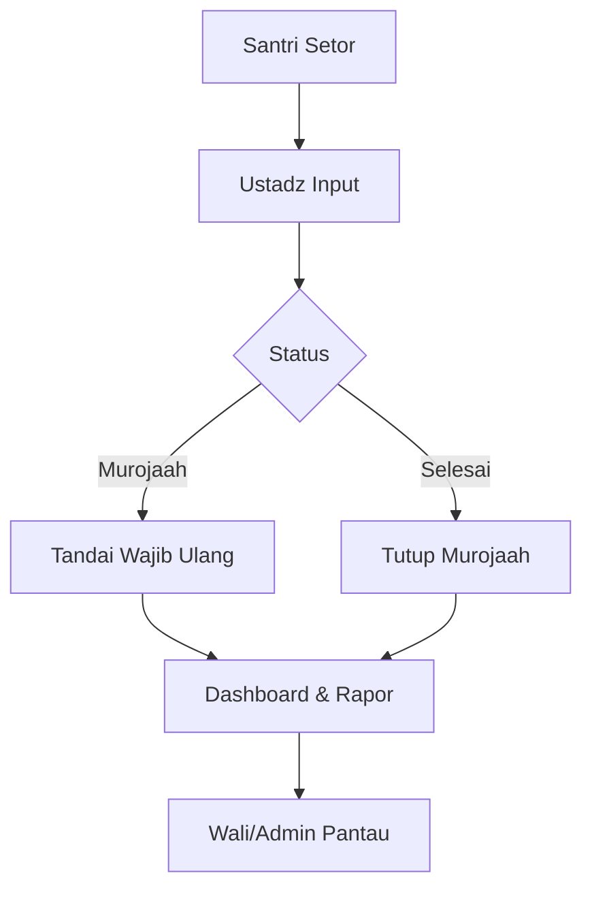

# 🧩 PKM-Hafalan-Flow

## 🎯 Tujuan
Dokumentasi ini memaparkan alur terbaru proses setoran hafalan santri di aplikasi Hafalan App. Kini setiap setoran hanya mencatat **satu ayat** dengan dua status sederhana:

- `murojaah` – hafalan yang masih perlu diulang.
- `selesai` – hafalan yang sudah dinyatakan lancar setelah murojaah.

---

## 🗃️ Struktur Tabel `hafalans`

| Kolom        | Tipe                                   | Keterangan                                       |
|--------------|----------------------------------------|---------------------------------------------------|
| `id`         | bigint                                 | Primary key                                      |
| `student_id` | FK → `students.id`                     | Referensi santri                                 |
| `teacher_id` | FK → `teachers.id` nullable            | Referensi ustadz (diambil dari user login)        |
| `surah_id`   | FK → `surahs.id`                       | Surat Al-Qur'an                                  |
| `from_ayah`  | unsignedSmallInteger                   | Ayat yang disetorkan                              |
| `to_ayah`    | unsignedSmallInteger                   | Disamakan dengan `from_ayah` (kompatibilitas)     |
| `date`       | date                                   | Tanggal setoran                                   |
| `status`     | enum(`murojaah`, `selesai`)             | Status hafalan                                    |
| `notes`      | text nullable                          | Catatan ustadz (opsional)                         |
| `created_at` | timestamp                              | Otomatis                                          |
| `updated_at` | timestamp                              | Otomatis                                          |

---

## ⚙️ Alur Proses

### 1. Santri Setor Hafalan
- Santri datang ke ustadz sesuai jadwal.
- Ustadz membuka halaman input `/hafalan/create`.

### 2. Ustadz Input Data
1. Pilih **Santri**, **Surah**, dan **Ayat** (satu ayat per entri).
2. Tentukan **Status**:
   - `murojaah` digunakan saat ayat masih perlu diasah; ustadz boleh mencatat ulang status ini berkali-kali untuk ayat yang sama sampai dinyatakan lancar.
   - `selesai` ketika ayat dinyatakan lancar; boleh dipilih pada setoran perdana selama tidak ada murojaah lain yang tertunda.
3. Opsional: isi catatan tambahan.

### 3. Validasi Sistem
- Ayat harus valid terhadap jumlah ayat di surah.
- Saat status `selesai` dipilih, sistem memastikan tidak ada murojaah santri yang tertunda di ayat lain. Jika ayat sudah pernah dicatat sebagai `murojaah`, ia harus ditutup terlebih dahulu.
- Saat form dibuka, sistem menampilkan daftar ayat yang masih berstatus `murojaah` agar ustadz dapat mengarahkan santri untuk mengulang terlebih dahulu.

### 4. Simpan Hafalan
```php
Hafalan::create([
    'student_id' => $request->student_id,
    'teacher_id' => auth()->user()->teacher?->id,
    'surah_id'   => $request->surah_id,
    'from_ayah'  => $request->from_ayah,
    'to_ayah'    => $request->from_ayah,
    'date'       => $request->date ?? now()->toDateString(),
    'status'     => $request->status,
    'notes'      => $request->notes,
]);
```

### 5. Siklus Murojaah
- Jika setoran disimpan sebagai `murojaah`, santri akan diminta mengulang ayat yang sama hingga ustadz menilai sudah lancar. Sistem mengizinkan beberapa entri `murojaah` berturut-turut untuk ayat yang sama.
- Status `selesai` menutup siklus murojaah untuk ayat tersebut.

### 6. Edit / Koreksi Data
- Ustadz dapat mengubah tanggal, catatan, atau status bila terjadi salah input.

---

## 💾 Contoh Data

| ID | Santri | Surah | Ayat | Status   | Tanggal    |
|----|--------|-------|------|----------|------------|
| 25 | Robby  | Al-Fatihah | 1 | murojaah | 2025-10-25 |
| 31 | Robby  | Al-Fatihah | 1 | selesai   | 2025-10-27 |

---

## 📊 Analitik Dashboard
- **Total Setoran**: jumlah seluruh entri hafalan.
- **Total Murojaah**: jumlah entri berstatus `murojaah`.
- **Total Selesai**: jumlah entri berstatus `selesai`.
- Grafik tren (Recharts) menampilkan total setoran per hari, garis hijau menunjukkan jumlah selesai, garis jingga menandai jumlah murojaah.
- Analitik admin juga menampilkan performa per kelas (bar total, garis murojaah/selesai).

---

## 🖨️ Rapor PDF
Rapor menampilkan riwayat kronologis per ayat:

```
Al-Fatihah 1 → Murojaah (25 Okt)
Al-Fatihah 1 → Selesai (27 Okt)
```

> Riwayat murojaah tetap ditampilkan sehingga wali dapat memantau progres pengulangan hafalan anak.

---

## 📈 Flowchart (Mermaid)



---

## ✅ Acceptance Criteria
- Setiap entri hanya menyimpan satu ayat dengan status `murojaah` atau `selesai`.
- Sistem memberi peringatan bila santri masih memiliki hafalan berstatus `murojaah`.
- Status `selesai` hanya dapat dicatat setelah status `murojaah` untuk kombinasi ayat yang sama.
- Dashboard menampilkan total setoran, total murojaah, dan total selesai.
- Rapor menampilkan riwayat lengkap termasuk murojaah.
